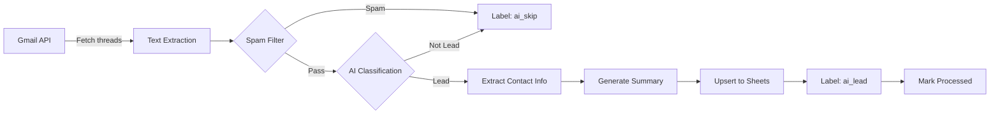

# 🤖 Gmail CRM Agent

> AI-powered email automation that transforms your Gmail inbox into a structured CRM database

[](https://www.python.org/downloads/)
[](https://opensource.org/licenses/MIT)
[](https://github.com/psf/black)

## 📋 Table of Contents
- [Overview](#-overview)
- [Features](#-features)
- [How It Works](#-how-it-works)
- [Quick Start](#-quick-start)
- [Configuration](#-configuration)
- [Usage](#-usage)
- [Architecture](#-architecture)
- [Documentation](#-documentation)
- [Contributing](#-contributing)
- [License](#-license)

## 🎯 Overview

**Gmail CRM Agent** is an intelligent automation tool that scans your Gmail inbox, identifies legitimate business leads, extracts contact information, and automatically updates your Google Sheets CRM—all powered by AI.

### The Problem It Solves
If your business receives hundreds of emails daily (mix of leads, spam, newsletters, notifications), manually sorting through them to find real opportunities is time-consuming and error-prone.

### The Solution
This agent automates the entire pipeline:
```
Gmail Inbox → Spam Filter → AI Classification → Contact Extraction → Google Sheets CRM
```

**Result:** You get a clean, organized CRM with only real leads, complete with extracted contact info and intelligent notes.

## ✨ Features

### 🔍 Smart Email Processing
- **Two-stage filtering**: Pre-LLM spam denylist + AI classification
- **Idempotent processing**: Never processes the same email twice
- **Thread-aware**: Analyzes full conversation context
- **HTML fallback**: Robust text extraction from any email format

### 🤖 AI-Powered Classification
- **Multi-provider support**: OpenAI (GPT-4) or Anthropic (Claude)
- **Conservative detection**: Defaults to "lead" when uncertain
- **High accuracy**: Filters out newsletters, auto-replies, notifications, spam

### 📊 Intelligent Contact Extraction
- **Structured data**: Company, name, email, phone, address, website
- **Multi-language support**: English, Russian, German, and more
- **Smart deduplication**: Updates existing leads instead of creating duplicates

### 📈 Google Sheets CRM Integration
- **Auto-upsert**: Inserts new leads or updates existing ones
- **Smart field merging**: Only overwrites empty fields, preserves history
- **Timestamped notes**: Appends new information without duplication
- **Clean schema**: 12 well-organized columns

### 🏷️ Gmail Organization
- Automatic labeling: `ai_lead`, `ai_skip`, `ai_error`
- Keeps your inbox clean and organized

### 💻 Developer-Friendly CLI
- Rich terminal UI with progress bars and tables
- Dry-run mode for safe testing
- Flexible flags: `--days`, `--max`, `--debug`, `--status`
- Comprehensive logging

## 🔄 How It Works



### Processing Pipeline

1. **Gmail Search** - Query inbox with configurable filters
2. **Spam Filtering** - Check denylist BEFORE expensive LLM calls
3. **AI Classification** - Determine if email is a real lead
4. **Contact Extraction** - Parse company, name, email, phone, etc.
5. **Summary Generation** - Create concise notes in your preferred language
6. **CRM Update** - Upsert to Google Sheets with smart deduplication
7. **Gmail Labeling** - Organize with automated labels
8. **State Tracking** - Record processing history to prevent duplicates

## 🚀 Quick Start

### Prerequisites
- Python 3.8+
- Google Cloud account with Gmail API + Sheets API enabled
- OpenAI API key OR Anthropic API key

### Installation

1. **Clone the repository**
```bash
git clone https://github.com/sasha-makarenko/gmail-crm-agent.git
cd gmail-crm-agent
```

2. **Create virtual environment**
```bash
python3 -m venv .venv
source .venv/bin/activate  # On Windows: .venv\Scripts\activate
```

3. **Install dependencies**
```bash
pip install -r requirements.txt
```

4. **Configure environment**
```bash
cp .env.example .env
# Edit .env with your credentials
```

5. **Setup Google OAuth**
   - Download `credentials.json` from [Google Cloud Console](https://console.cloud.google.com/)
   - Place in project root
   - First run will open browser for OAuth consent

6. **Test with dry run**
```bash
python -m agents.main --dry-run --max 5 --debug
```

7. **Run for real**
```bash
python -m agents.main
```

## ⚙️ Configuration

### Environment Variables

Create a `.env` file (use `.env.example` as template):

```bash
# LLM Provider (choose one)
MODEL_PROVIDER=openai  # or "anthropic"

# OpenAI (if using OpenAI)
OPENAI_API_KEY=sk-...
OPENAI_MODEL=gpt-4o-mini  # optional, default shown

# Anthropic (if using Anthropic)
ANTHROPIC_API_KEY=sk-ant-...
ANTHROPIC_MODEL=claude-3-5-sonnet-20241022  # optional

# Gmail Configuration
GMAIL_USER=your@email.com
GMAIL_QUERY=to:your@email.com -in:chats

# Google Sheets
GOOGLE_SHEETS_ID=your_spreadsheet_id_here
GOOGLE_SHEETS_TAB=Leads

# Optional (with defaults)
GOOGLE_TOKEN_PATH=token.json
SPAM_RULES=spam_rules.yaml
PROCESSED_STORE=data/processed.jsonl
MAX_THREADS=50
```

### Spam Rules

Customize `spam_rules.yaml` to fine-tune filtering:

```yaml
allowlist:
  emails:
    - "important-client@example.com"
  domains:
    - "trusted-partner.com"

denylist_emails:
  - "noreply@linkedin.com"
  - "noreply@amazon.com"

denylist_domains:
  - "linkedin.com"
  - "facebook.com"
  - "mailchimp.com"

denylist_regex:
  - pattern: "\\b(unsubscribe|opt-out)\\b"
    case_insensitive: true
    reason: "Newsletter"
```

## 📖 Usage

### Common Commands

```bash
# Dry run (test without writing to Sheets)
python -m agents.main --dry-run

# Process last 7 days only
python -m agents.main --days 7

# Limit to 10 threads
python -m agents.main --max 10

# Debug mode (verbose logging)
python -m agents.main --debug

# Check processing statistics
python -m agents.main --status

# Clear state (reprocess all emails)
python -m agents.main --clear-state
```

### Example Output

```
Gmail CRM Agent
======================================================================
Initializing components...
✓ Using LLM provider: openai
✓ Spam rules loaded from: spam_rules.yaml
✓ State store: data/processed.jsonl
✓ Google Sheets access validated
✓ Gmail labels ready

Searching Gmail with query: to:hello@example.com -in:chats
Max results: 50

Found 12 threads, 5 unprocessed

Processing threads... ━━━━━━━━━━━━━━━━━━━━━━━━━━━━━━━━━━━━ 100%

Processing Complete!
┏━━━━━━━━━━━━━━━━━━━┳━━━━━━━┓
┃ Metric            ┃ Count ┃
┡━━━━━━━━━━━━━━━━━━━╇━━━━━━━┩
│ Total Processed   │ 5     │
│ Leads Found       │ 2     │
│ Spam (Denylist)   │ 1     │
│ Skipped (LLM)     │ 2     │
│ Errors            │ 0     │
└───────────────────┴───────┘
```

### Google Sheets Schema

The agent creates/updates a sheet with this structure:

| Company | Address | Website | LPR Name | LPR Phone | LPR Email | Notes | Source | ThreadId | FirstSeen | LastUpdated | Status |
|---------|---------|---------|----------|-----------|-----------|-------|--------|----------|-----------|-------------|--------|
| ACME Corp | 123 Main St | acme.com | John Doe | +1234567890 | john@acme.com | Inquiry about bulk order. Mentioned 500kg needed... | Gmail | 18f3b2a... | 2025-06-15 | 2025-06-17 | New |

## 🏗️ Architecture

```
gmail-crm-agent/
├── agents/
│   ├── __init__.py
│   ├── config.py          # Configuration loader
│   ├── gmail_client.py    # Gmail API wrapper
│   ├── sheets_client.py   # Google Sheets API
│   ├── llm.py            # Multi-provider LLM integration
│   ├── spam_filter.py    # Pre-LLM filtering
│   ├── state_store.py    # Processing state tracking
│   ├── main.py           # Main orchestration pipeline
│   └── utils.py          # Helper functions
├── data/
│   └── processed.jsonl   # Processing history (auto-generated)
├── .env                  # Your configuration
├── .env.example          # Template
├── spam_rules.yaml       # Spam filtering rules
├── requirements.txt      # Python dependencies
├── README.md            # This file
├── IMPLEMENTATION_SUMMARY.md  # Detailed technical docs
└── QUICKSTART.md        # Quick setup guide
```

### Tech Stack
- **Python 3.8+**
- **LLM Providers**: OpenAI (GPT-4), Anthropic (Claude)
- **APIs**: Gmail API, Google Sheets API
- **Libraries**:
  - `google-api-python-client` - Google APIs
  - `openai` / `anthropic` - LLM providers
  - `gspread` - Google Sheets
  - `rich` - CLI UI
  - `pyyaml` - Configuration
  - `html2text` - Email parsing

## 📚 Documentation

- **[QUICKSTART.md](QUICKSTART.md)** - 5-minute setup guide
- **[IMPLEMENTATION_SUMMARY.md](IMPLEMENTATION_SUMMARY.md)** - Detailed technical documentation
- **[spam_rules.yaml](spam_rules.yaml)** - Spam filtering configuration

## 🔒 Security

**⚠️ NEVER commit these files:**
- `.env` (contains API keys)
- `token.json` (OAuth token)
- `credentials.json` (Google OAuth credentials)

All sensitive files are already in `.gitignore`.

## 🛠️ Troubleshooting

### "Missing required environment variables"
Check your `.env` file has all required fields. Compare with `.env.example`.

### "Cannot access Google Sheets"
1. Verify `credentials.json` exists in project root
2. Delete `token.json` and re-authenticate
3. Check APIs are enabled in Google Cloud Console
4. Verify `GOOGLE_SHEETS_ID` in `.env`

### Too many spam detections
1. Check `spam_rules.yaml` denylist patterns
2. Add legitimate senders to allowlist

### Not enough leads found
1. LLM defaults to "lead" when uncertain (conservative)
2. Run with `--debug` to see classification reasons
3. Check denylist isn't too aggressive

## 🤝 Contributing

Contributions are welcome! Please:

1. Fork the repository
2. Create a feature branch (`git checkout -b feature/AmazingFeature`)
3. Commit your changes (`git commit -m 'Add some AmazingFeature'`)
4. Push to the branch (`git push origin feature/AmazingFeature`)
5. Open a Pull Request

## 📄 License

This project is licensed under the MIT License - see the [LICENSE](LICENSE) file for details.

## 🙏 Acknowledgments

- Built for B2B companies drowning in email
- Inspired by the need to automate repetitive lead qualification
- Powered by OpenAI GPT-4 and Anthropic Claude

## 📧 Contact

Aleksandr Makarenko - [@sasha-makarenko](https://github.com/sasha-makarenko)

Project Link: [https://github.com/sasha-makarenko/gmail-crm-agent](https://github.com/sasha-makarenko/gmail-crm-agent)

---

**Made with ❤️ for busy entrepreneurs who need their time back**
